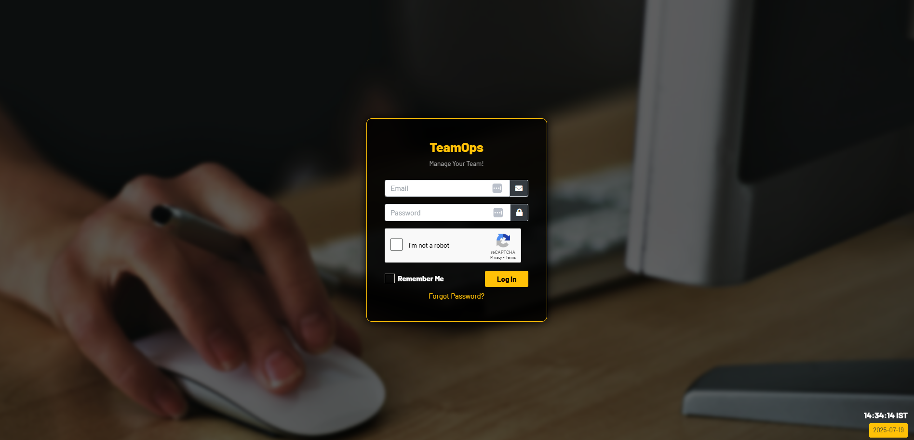
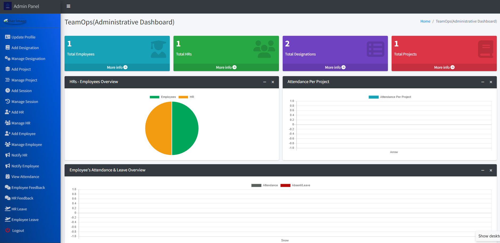

# 🏢 Office Management System

A comprehensive web-based Office Management System built with **Django**. It includes role-based dashboards for Admin, HR, and Employees, and allows management of designations, work modes, assets, projects, attendance, feedback, leaves, and more.

## 🔥 Screenshots





---

## 🚀 Features

### 🔐 Admin Can:

1. View overall summary charts for employees, projects, leaves, etc.
2. Manage HRs (Add, Edit, Delete)
3. Manage Employees (Add, Edit, Delete)
4. Manage Designations
5. Manage Projects allocation
6. View All Attendance Reports
7. Approve/Reject Leave Applications
8. Review Feedback from HRs and Employees
9. Send Notifications to HRs and Employees
10. Edit Admin Profile

---

### 👨‍💼 HR Can:

1. View summary charts for assigned employees and projects
2. Manage Employee Attendance
3. Apply for Leave
4. Send Feedback to Admin
5. Receive Notifications
6. Edit HR Profile

---

### 👷 Employee Can:

1. View assigned projects, leave status, and attendance reports
2. Apply for Leave
3. Send Feedback to HR/Admin
4. Receive Notifications
5. View Asset Issues
6. Edit Employee Profile

---

## 🧰 Tech Stack

* Django (Backend)
* HTML5, CSS3, JavaScript (Frontend)
* SQLite (Default DB – can be replaced)
* Bootstrap 4/5 for styling
* Chart.js for dashboard visualizations

---

## 📂 Repository

🔗 [GitHub Repository](https://github.com/SujayKumarMondal/TeamOps)

---

## 🛠 Installation & Setup Guide

### ✅ Prerequisites

* Python 3.8+
* pip
* Git
* Virtualenv (optional but recommended)

---

### 📦 Steps to Install

#### 1. Clone the Repository

```bash
git clone https://github.com/SujayKumarMondal/TeamOps.git
```

#### 2. Create & Activate Virtual Environment (Recommended)

**Windows:**

```bash
python -m venv venv
venv\Scripts\activate
```

**Linux/macOS:**

```bash
python3 -m venv venv
source venv/bin/activate
```

#### 3. Install Required Packages

```bash
pip install -r requirements.txt
```

#### 4. Migrate Database

```bash
python manage.py makemigrations
python manage.py migrate
```

#### 5. Create Superuser (Admin)

```bash
python manage.py createsuperuser
```

#### 6. Run Development Server

```bash
python manage.py runserver
```

Then go to the development server

---

## 🧪 Default Roles

* **Admin** (created via `createsuperuser`)
* **HRs & Employees** are created from the admin dashboard

---

## 🧩 Functional Modules

* Admin, HR, Employee Role Management
* CRUD for HRs, Employees, Designations, Projects
* Attendance and Leave Management
* Feedback and Notification System
* Dynamic Dashboards and Reports
* Profile Management and Authentication
* Django Admin Panel Integration

---

## ⭐ Contributing & Support

If you like this project:

1. 🌟 Star this repo
2. 🤝 Fork & Contribute
3. 🧑‍💼 Connect with me on [LinkedIn](https://linkedin.com/in/sujaykumarmondal)

---

## 📜 License

This project is licensed under the MIT License.

---

Let me know if you'd like this `README.md` exported to a file or with additional badges (build status, license, etc).
